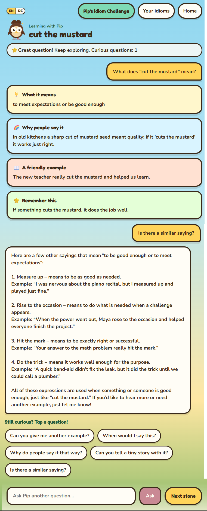
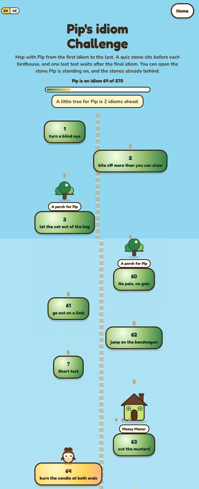
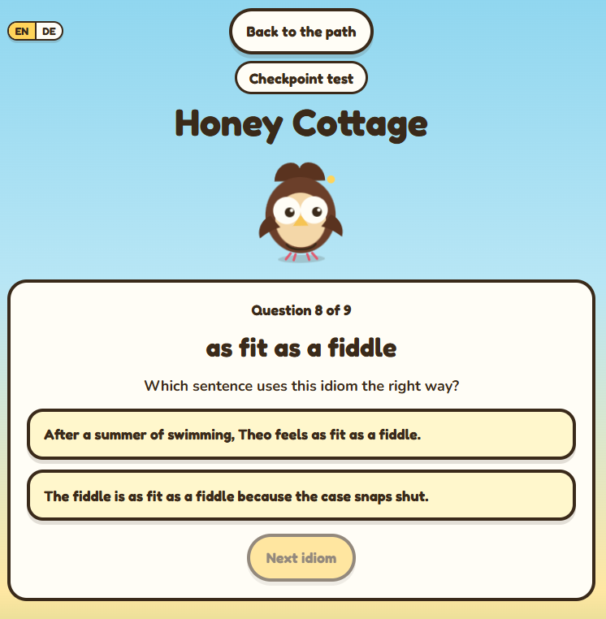

# localLLMSemanticKernel

In this project we plan to use a local text generation model and see how far we can go using semantic search and other tools to turn it into an idioms explaining tool for children.

Currently one is able to carry out a conversation, store it and retrieve it for continuing it later. No personal data is collected by the app. It is fully anonymous.

Due to limited cloud capacities however we had to switch to an API based model inference instead of a local model.

---

# Example Conversation

An example of Pip explaining **cut the mustard**.



**You:** What does "cut the mustard" mean?

**Pip:** Great question! Keep exploring.

**What it means**

to meet expectations or be good enough

**Why people say it**

In old kitchens a sharp cut of mustard seed meant quality; if it 'cuts the mustard' it works just right.

**A friendly example**

The new teacher really cut the mustard and helped us learn.

**Remember this**

If something cuts the mustard, it does the job well.

---

**You:** Is there a similar saying?

**Pip:** Here are a few other sayings that mean "to be good enough or to meet expectations":

1. **Measure up** — means to be as good as needed.

   Example: "I was nervous about the piano recital, but I measured up and played just fine."

2. **Rise to the occasion** — means to do what is needed when a challenge appears.

   Example: "When the power went out, Maya rose to the occasion and helped everyone finish the project."

3. **Hit the mark** — means to be exactly right or successful.

   Example: "Your answer to the math problem really hit the mark."

4. **Do the trick** — means it works well enough for the purpose.

   Example: "A quick band-aid didn't fix the leak, but it did the trick until we could call a plumber."

All of these expressions are used when something or someone is good enough, just like "cut the mustard." If you'd like to hear more or need another example, just let me know!

**Still curious? Tap a question!**

- Can you give me another example?

- When would I say this?

- Why do people say it that way?

- Can you tell a tiny story with it?

- Is there a similar saying?

The learner can type another question and choose **Ask**.

---

# Pip's idiom Challenge

The challenge is a path of stepping stones that Pip hops along, from the first idiom to the last.



## How to play

1. **Open a stone.** Each stone holds one idiom. Opening it starts a conversation with Pip about that idiom, like the example above.

2. **Hop to the next stone.** When you are done exploring, choose **Next stone** and Pip moves forward along the path. The highlighted stone shows where Pip is standing.

3. **Look back any time.** You can open the stone Pip is standing on and every stone already behind. Stones further ahead stay locked until Pip reaches them.

4. **Take the short test.** A quiz stone, marked **?**, sits before each birdhouse. Pass the short test to hop on to the birdhouse. If Pip is not ready yet, revisit the stones behind you to freshen up, then try the test again.

5. **Reach the birdhouses.** Every few hops Pip passes a little tree, "a perch for Pip", and every ninth stone a brighter birdhouse such as **Mossy Manor**.

6. **Finish the path.** One last test waits after the final idiom. Pass it to reach the grand birdhouse at the end of the path.

The top of the page shows Pip's progress, for example **Pip is on idiom 64 of 270**, along with a hint about what is coming next, such as the next tree or birdhouse.

---

# Checkpoint tests

A quiz stone sits before each birdhouse, and one last test waits after the final idiom. You can hop on to the next stones, or reach the grand birdhouse at the end of the path, only if you pass the test.



## How a test looks

Each test is labelled **Checkpoint test**, or **Last test** for the quiz after the final idiom. The birdhouse you are aiming for is shown at the top, for example **Honey Cottage**.

For every question, Pip shows one idiom you have already met and asks:

**Which sentence uses this idiom the right way?**

There are two sentences. One uses the idiom correctly. The other sounds similar but is wrong. Choose a sentence, then tap **Next idiom**. On the last question the button changes to **See the score**.

A short test covers the nine idioms on the stones leading up to that birdhouse, for example **Question 8 of 9**. The last test works the same way for the last nine idioms on the path.

You can leave with **Back to the path** and try the test again later.

## How to pass

You need **at least 4 answers right** out of 9.

**If you pass**, Pip knows the idioms well enough to hop on. You can then:

- reach the next birdhouse and continue to the stones beyond it, or
- on the last test, reach the grand birdhouse at the end of the path.

**If you do not pass**, Pip is not ready yet. You cannot hop on to the next stones or the grand birdhouse. Choose **Back to the stones**, revisit the idioms you have already learned to freshen up, then try the test again.

---

# Local Development

This section describes how to get the project running locally from a fresh checkout.

## Prerequisites

The following software is required:

* Git

* Docker Desktop

On Windows, Docker Desktop must be installed and **running before executing the Docker commands below**.

There is no need to install the following directly on the host machine:

* Python

* Node.js

* PostgreSQL

* Ollama

The application runs these dependencies through Docker.

## 1. Clone the repository

Clone the repository and enter the project directory:

```powershell

git clone https://github.com/Dr-Banerjee/localLLMSemanticKernel.git

cd localLLMSemanticKernel

```

## 2. Create the local environment file

Create a file named:

```text

.env.docker

```

This file is intended for local development only.

A minimal example is:

```dotenv

POSTGRES_DB=<your-db-name>

POSTGRES_USER=<your-user-name>

POSTGRES_PASSWORD=<change-this-local-password>

DATABASE_URL=postgresql+asyncpg://<your user name>:<change-this-local-password>@postgres:5432/<your-db-name>

APP_ENV=development

ANONYMOUS_SESSION_LIFETIME_DAYS=30

SESSION_COOKIE_NAME=session

SESSION_COOKIE_SECURE=false

SESSION_COOKIE_SAMESITE=lax

CORS_ALLOWED_ORIGINS=http://localhost:5173

VITE_API_BASE_URL=http://localhost:8001

```

Use your own local database password instead of `<change-this-local-password>`.

The `.env.docker` file should **not be committed to Git**.

## 3. Build and start the application

Make sure Docker Desktop is running, then execute:

```powershell

docker compose --env-file .env.docker up -d --build

```

This starts:

* PostgreSQL

* Backend

* Ollama

* Frontend

The first build may take some time because the required images and Python/Node dependencies need to be downloaded.

## 4. Run database migrations

After the containers have started, run:

```powershell

docker compose --env-file .env.docker exec backend alembic upgrade head

```

This creates or updates the database schema using the Alembic migrations contained in the repository.

## 5. Sign in to Ollama

The application currently uses an Ollama-hosted cloud model.

To authenticate the local Ollama container:

```powershell

docker compose --env-file .env.docker exec ollama ollama signin

```

Follow the instructions displayed by Ollama.

The Ollama authentication information is stored in the Docker volume and should not be committed to the repository.

## 6. Open the application

Once all services are running, the frontend is available at:

```text

http://localhost:5173

```

The backend API is exposed locally on:

```text

http://localhost:8001

```

The FastAPI/Swagger documentation is available at:

```text

http://localhost:8001/docs

```

## Local Port Configuration

The backend listens on port `8000` **inside its Docker container**.

For local development, Docker exposes that port on host port `8001`:

```text

localhost:8001 -> backend:8000

```

The frontend is available on:

```text

localhost:5173

```

The PostgreSQL database is available locally on:

```text

localhost:5432

```

The backend itself connects to PostgreSQL using the Docker service name:

```text

postgres:5432

```

Therefore, the `DATABASE_URL` used inside Docker must use `postgres` as the database host rather than `localhost`.

## Useful Local Docker Commands

### Check running containers

```powershell

docker compose --env-file .env.docker ps

```

### View backend logs

```powershell

docker compose --env-file .env.docker logs -f backend

```

### View frontend logs

```powershell

docker compose --env-file .env.docker logs -f frontend

```

### View PostgreSQL logs

```powershell

docker compose --env-file .env.docker logs -f postgres

```

### View Ollama logs

```powershell

docker compose --env-file .env.docker logs -f ollama

```

### Stop the application

```powershell

docker compose --env-file .env.docker down

```

Stopping the containers does **not** delete the Docker volumes. The local PostgreSQL data therefore remains available when the application is started again.

### Rebuild the application

If application code or dependencies have changed:

```powershell

docker compose --env-file .env.docker up -d --build

```

## Resetting the Local Database

If the local database needs to be completely reset:

```powershell

docker compose --env-file .env.docker down -v

```

Then start the application again:

```powershell

docker compose --env-file .env.docker up -d --build

```

Finally, run the migrations:

```powershell

docker compose --env-file .env.docker exec backend alembic upgrade head

```

**Warning:** `docker compose down -v` deletes the local Docker volumes, including the PostgreSQL data.

---

# Production Deployment

Production deployment is handled separately from local development using Coolify.

The production environment uses:

* Docker Compose

* PostgreSQL

* FastAPI backend

* React/Vite frontend

* Ollama

* HTTPS through the production reverse proxy

* Alembic database migrations

Production configuration and credentials are managed through the deployment environment rather than being stored in this repository.

## Production Database Migrations

Database migrations are executed automatically as part of the production deployment using:

```text

alembic upgrade head

```

The migration command runs against the production database during deployment.

This means that developers should **not** manually modify the production database schema.

Schema changes should be implemented through new Alembic migrations and deployed through the normal development and review process.

## Production Environment Variables

Production environment variables are configured through the deployment environment.

They must not be added to this README or committed to Git.

In particular, do not commit:

* Database passwords

* Database connection strings containing credentials

* API keys

* Authentication tokens

* Session secrets

* Ollama credentials

* SSH keys

* Other production secrets

---

# Development Workflow

Changes should follow the branch and review process described below.

The `main` branch represents the current production stand.

The `development` branch represents the latest shared development state that is known to be stable.

Developers should create feature or change branches from `development`, implement and test their changes locally, and then open a pull request targeting `development`.

---

# Rules Regarding Modification or Expansion of Code

## 1. Production branch

The branch named `main` is the current production stand.

**Never push code directly to `main`.**

Make it a priority not to break the production branch.

## 2. Development branch

The branch named `development` is supposed to be the latest development stand.

Try your best to make sure that it is always functioning in the local development environment.

**Never push code directly to `development`.**

## 3. Creating a development branch

When adding or modifying code:

1. Create a new branch in GitHub based on the `development` branch.

2. Check out the new branch locally.

3. Implement the changes there.

4. Test the changes locally.

5. Make sure existing functionality has not been broken.

## 4. Pull request

Create a pull request with:

```text

Target branch: development

```

## 5. Code review

The pull request must be reviewed by at least one person.

The reviewer should focus on:

### a. Functionality

Test the functionality and make sure that existing functionality has not been broken.

### b. Reuse

Make sure that existing components are reused whenever possible instead of creating new ones unnecessarily.

### c. Avoiding repetition

Make sure that code is not repeated unless there is no reasonable alternative.

### d. Security

Make sure that no security vulnerabilities are introduced.

For example, vulnerabilities can be introduced by using outdated libraries, insecure authentication or authorization logic, unsafe handling of user input, incorrect handling of secrets, and many other ways.

### e. Sensitive information

Sensitive information must be protected using an appropriate mechanism.

Where passwords or other credentials need to be stored for authentication purposes, proper password hashing or other appropriate cryptographic protection must be used rather than storing the original secret.

Secrets, credentials, API keys, tokens, and private keys must never be committed to the repository.

### f. Architecture

Existing software architecture patterns should be preserved.

New code should fit into the existing architecture rather than introducing unnecessary competing patterns.

A summary of the architectural decisions can be found in [`architectural-decisions.md`](architectural-decisions.md).

## 6. Review approval

When the review passes, the reviewer should approve the pull request with the comment:

```text

Local testing successful.

```

## 7. Merging into development

Merges into `development` are to be carried out exclusively by a select group of developers.

Currently, this group consists only of:

**Dr. Banerjee**

## 8. Merging into production

Merges into production are also to be carried out exclusively by a select group of developers.

Currently, this group consists only of:

**Dr. Banerjee**

---

# Repository Structure

The main parts of the repository are organized approximately as follows:

```text

.

├── alembic/

│   └── Database migration scripts

├── app/

│   └── Backend application

├── appFrontend/

│   └── Frontend application

├── tests/

│   └── Automated tests

├── .gitignore

├── alembic.ini

├── compose.yaml

├── Dockerfile

├── pyproject.toml

└── README.md

```

The local Docker environment is defined in `compose.yaml`.

Database schema changes are managed through Alembic migrations.

The frontend, backend, PostgreSQL database, and Ollama are separate services within the Docker Compose application and are maintained in the same repository.
